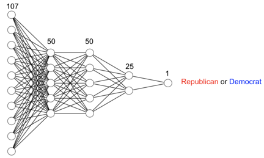

# voting-outcome

Using simple deep neural networks (DNN), this project aimed to predict voting outcome on the basis of people’s responses on various questions. In doing so, I pitted the neural networks against other neural networks on the Kaggle challenge: https://www.kaggle.com/c/can-we-predict-voting-outcomes#description. Moreover, by feature-engingeering the complex data provided by Kaggle as much as possible, the project tested the performance limitation of the simple DNN. 

## Data

The training and testing data from Kaggle came from Show of Hands, a mobile and web polling platform. For each participant, there were 107 questions to answer, including the political party the participant voted for. Of the 107 questions, 5 were demographic information, and 102 were questionnaire answers. Questions asked are available on "Questoins.pdf"

## Getting Started

run ipynb files on Jupyter Notebook.


## Running the tests




### Break down into end to end tests

Explain what these tests test and why

```
Give an example
```


First_version


### And coding style tests

Explain what these tests test and why

```
Give an example
```


## Authors

* **Suhwan Choi** - *Initial work* - [PurpleBooth](https://github.com/PurpleBooth)

See also the list of [contributors](https://github.com/your/project/contributors) who participated in this project.
Joshua Archer
